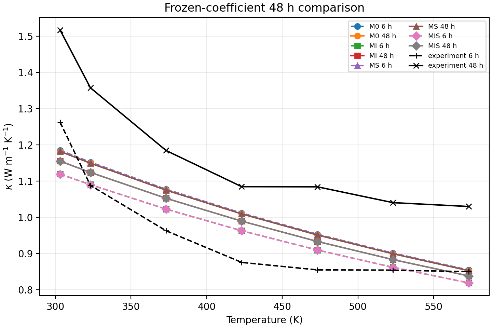
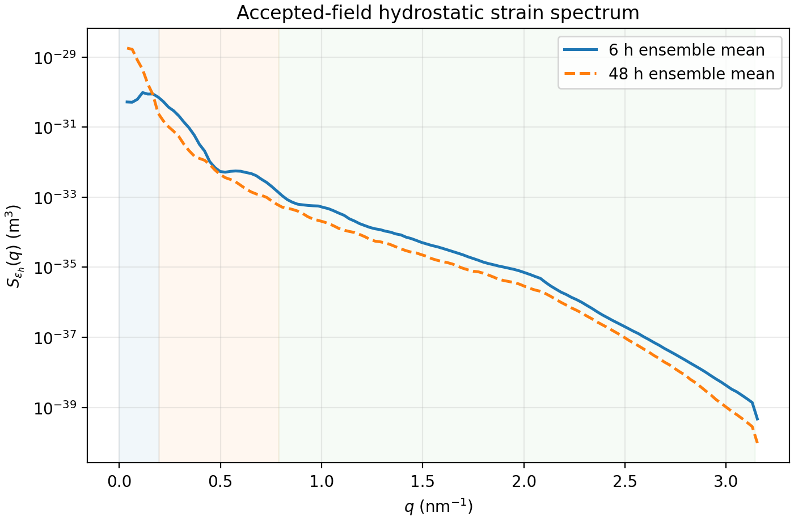
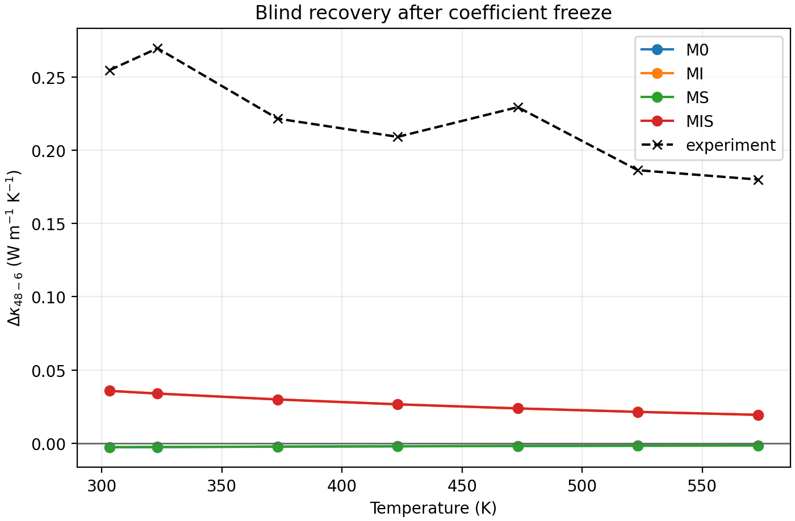

# PbTe--Ag2Te粗化、完整PSD、界面与相干应变晶格热输运综合报告

## 报告身份与最终判定

本报告汇总Yu 2024 Debye散射框架、Method-1 A/B/C相场完整PSD、Sheskin
2018实验热导率、界面散射和相干应变散射的现有冻结证据。它是对已经完成并
通过provenance审计的结果进行的中文综合解释，不修改原始PF场、checkpoint、
热力学参数、PSD、弹性常数或既有正式报告。

```text
REPORT_STATUS=PASS_COMPREHENSIVE_SYNTHESIS_OF_FROZEN_EVIDENCE_V1
SCIENTIFIC_STATUS=FAIL_RESOLVED_ONLY_AFTER_INTERFACE_AND_STRAIN_TEST
ABSOLUTE_EXPERIMENTAL_KAPPA_REPRODUCTION_CLAIMED=false
FIRST_PRINCIPLES_DFT_RESULT=false
DISLOCATION_MODE=OFF
YU_S_DIS_0P1172768_USED=false
```

最终科学结论是：

1. 只使用Yu公开非颗粒host散射、PF完整resolved PSD和PF远场基体Ag时，
   573.15 K下预测由6 h的`1.29809`轻微下降至48 h的`1.29490 W m^-1 K^-1`，
   与实验的`0.85 -> 1.03 W m^-1 K^-1`方向相反。
2. 加入由AQ数据确定的时间不变经验背景后，resolved界面散射能够稳定恢复
   `kappa(48 h) > kappa(6 h)`的正确方向。
3. 在最终界面+应变模型MIS中，573.15 K等权诊断均值为
   `0.820883 -> 0.849037 W m^-1 K^-1`，增加`0.028154 W m^-1 K^-1`，
   即`+3.430%`。
4. 该等权均值不是概率意义上的期望值。保守的18成员非概率背景包络给出48 h
   `0.836254--0.911327 W m^-1 K^-1`，背景成员的相对恢复为
   `+2.115--+7.267%`。其中两个上界诊断成员触及`alpha=10`并被参数物理性门
   拒绝；仅保留16个界内成员时，48 h范围为`0.836254--0.867506`，恢复范围为
   `+2.115--+6.191%`。无论采用哪种口径，全部低于实验`1.03 W m^-1 K^-1`，
   也未达到预注册的`10--30%`恢复门。
5. 相干静水应变Born通道只改变约`1e-4 W m^-1 K^-1`，对最终热导率几乎
   可忽略。正确趋势基本全部来自随粗化显著下降的PF界面面积密度`Sv`。
6. 因此，resolved Ag2Te颗粒的density-contrast、界面面积和当前scalar
   coherent-strain模型可以解释趋势方向的一部分，但不能解释实验恢复幅度。

## 1. 需要严格区分的两篇文献和三种数据身份

### 1.1 Yu 2024

Yu等人的工作提供：

- 单总松弛时间Debye积分；
- phonon--phonon、晶界、点缺陷、析出物和位错散射公式；
- AQ和48 h两套公开参数；
- 论文中的Debye--Callaway计算曲线。

Yu的曲线是模型计算结果，不是Sheskin实验数据。公开的Yu 48 h S13参数还存在
不可消除的复现缺口：严格按公开S13公式和Table S2计算时，48 h模型曲线MAPE约
`43.35%`；约303.94 K时严格S13结果为`1.0268 W m^-1 K^-1`，而论文数字化
模型曲线约为`1.9993 W m^-1 K^-1`。反演得到的约`0.117`等效位错散射强度只能
作为诊断证据，不能当作作者公开拟合参数，也没有用于当前PF输运。

### 1.2 Sheskin 2018

Sheskin等人的Figure 5c给出AQ、6 h和48 h的实测总热导率。正文在300 °C
明确给出：

\[
\kappa_{6h}^{\rm exp}=0.85,\qquad
\kappa_{48h}^{\rm exp}=1.03\ {\rm W\,m^{-1}K^{-1}},
\]

\[
\Delta\kappa^{\rm exp}=+0.18\ {\rm W\,m^{-1}K^{-1}},\qquad
\frac{\Delta\kappa}{\kappa_{6h}}=+21.18\%.
\]

这些量的原始身份是`MEASURED_TOTAL_KAPPA`。论文报告电子热导率比晶格项约低
四个数量级，所以在当前数字化分辨率下可以把总热导率作为近似晶格热导率锚点，
但不能把它改名为“直接测量的晶格热导率”。

Sheskin报告了Ag-decorated dislocation的定性观察，但没有给出可直接进入S12/S13
公式的权威位错密度`N_D`。因此不能从该论文为当前PF轨迹指定数值位错散射率。

### 1.3 当前PF输出

PF输出是条件计算量：

\[
\kappa_L^{\rm no-dis}(T,t),\qquad
\Delta\kappa_{\rm PSD},\qquad
\Delta\kappa_{\rm PSD+matrix}.
\]

它不是Yu曲线，也不是Sheskin测量值。三者在所有报告中必须分列。

## 2. 理论计算不是DFT

本报告中的“理论热导率”来自半经验Debye松弛时间积分，不是VASP、Quantum
ESPRESSO或其他第一性原理声子/界面输运计算。没有使用DFT截断能、k点网格、
赝势、SOC、三阶力常数或声子BTE输入。

本项目中GPU完成的是连续体相场演化、FFT弹性求解、accepted-field replay和数值
积分加速。GPU只改变计算速度，不改变模型物理。160^3单颗粒profile的“弹性松弛”
也是相场/连续体弹性最小化，不应称为DFT。

## 3. Debye热输运总方程

采用的单松弛时间Debye积分为：

\[
\kappa_L(T)=\frac{k_B}{2\pi^2v}
\left(\frac{k_BT}{\hbar}\right)^3
\int_0^{\Theta_D/T}\tau_{\rm tot}(x,T)
\frac{x^4e^x}{(e^x-1)^2}\,dx,
\qquad x=\frac{\hbar\omega}{k_BT}.
\]

最终候选模型的散射率写为：

\[
\tau_{\rm tot}^{-1}=
\tau_{U+N}^{-1}+
\tau_{GB}^{-1}+
\tau_{PD}^{-1}+
\tau_{\rm PSD}^{-1}+
\tau_{\rm bg}^{-1}+
\tau_I^{-1}+
\tau_S^{-1}.
\]

不同模型包含的项为：

| 模型 | host+PF PSD | AQ背景 | PF界面 | PF相干应变 |
|---|---:|---:|---:|---:|
| density-only baseline | 是 | 否 | 否 | 否 |
| M0 | 是 | 是 | 否 | 否 |
| MI | 是 | 是 | 是 | 否 |
| MS | 是 | 是 | 否 | 是 |
| MIS | 是 | 是 | 是 | 是 |

## 4. 固定材料参数与数值参数

### 4.1 Yu非颗粒host参数

| 参数 | 数值 | 在模型中的作用 | 参数身份 |
|---|---:|---|---|
| `A_N` | 1.5 | 合并的Normal+Umklapp强度 | Yu公开fitted值，本项目冻结 |
| `gamma` | 1.96 | phonon--phonon与scalar strain耦合 | Yu公开值 |
| `Mbar` | `2.784e-25 kg` | 平均原子质量 | Yu公开值 |
| `v` | `1770 m/s` | 平均声速 | Yu公开值 |
| `Theta_D` | `136 K` | Debye上限 | Yu公开值 |
| 固溶体晶格常数 | `6.445 angstrom` | `Vbar=a^3/8` | Yu 48 h公开值 |
| 晶粒尺寸 | `12.1 micrometre` | `tau_GB^-1=v/d` | Yu 48 h公开值 |
| 点缺陷`epsilon` | 65 | 尺寸失配权重 | Yu公开值 |
| `Delta M_i` | `107.87 g/mol` | 点缺陷质量项 | 按SI字面值保留 |
| 基体原子质量 | `207.2 g/mol` | 点缺陷质量归一化 | 公开输入 |
| Pb/Ag原子半径 | `180/160 pm` | 点缺陷尺寸失配 | 公开输入 |
| PbTe密度 | `8383 kg/m^3` | 析出物density contrast | 公开输入 |
| 密度差 | `63 kg/m^3` | 析出物density contrast | 公开输入 |

phonon--phonon散射为：

\[
\tau_{U+N}^{-1}=A_N\frac{2}{(6\pi^2)^{1/3}}
\frac{k_B\bar V^{1/3}\gamma^2\omega^2T}{\bar Mv^3}.
\]

点缺陷项为：

\[
\tau_{PD}^{-1}=\frac{\bar V\omega^4}{4\pi v^3}\Gamma,
\]

其中当前`Gamma`中的Ag分数不是固定使用Yu的`0.0034`，而是读取每个PF快照
的远场matrix `xAg`。

### 4.2 数值积分

- 573.15 K直接计算，不使用550--600 K线性插值作为最终端点；
- Debye积分使用512点Gauss--Legendre求积；
- 温度曲线使用303.15、323.15、373.15、423.15、473.15、523.15和
  573.15 K的Sheskin实验点；
- scalar strain频谱在`q=0`去除零模，`q>pi/dx`不外推；
- `dx=1 nm`。

## 5. PF完整PSD和基体浓度输入

### 5.1 权威数据源

使用Method-1 A/B/C各自唯一的完整production PASS权威轨迹。每条轨迹均具有：

- 根`status.txt`生产PASS；
- 完整`audit.json`；
- merge-aware小时谱系门PASS；
- 44项checkpoint哈希链；
- fixture、参数、二进制和分析provenance。

热输运不重新运行PF，也不改变checkpoint。

### 5.2 逐颗粒full-PSD散射

Yu原模型使用small和big两个平均半径人口。当前模型将其替换为PF逐颗粒直接求和：

\[
\tau_{\rm PSD}^{-1}(\omega,t)=\frac{v}{V_{\rm box}}
\sum_i\sigma_{\rm eff}(R_i,\omega),
\]

\[
\sigma_{\rm eff}=\left(\sigma_S^{-1}+\sigma_l^{-1}\right)^{-1},
\quad \sigma_S=2\pi R^2,
\]

\[
\sigma_l=\frac49\pi R^2
\left(\frac{\Delta D}{D_M}\right)^2
\left(\frac{\omega R}{v}\right)^4.
\]

物理盒为`246^3 nm^3`。6 h时A/B/C均有96个resolved连通域；48 h时分别为：

| replicate | 6 h颗粒数 | 48 h颗粒数 | 6 h matrix `xAg` | 48 h matrix `xAg` |
|---|---:|---:|---:|---:|
| A | 96 | 5 | 0.006203008 | 0.006300822 |
| B | 96 | 8 | 0.006203254 | 0.006474213 |
| C | 96 | 3 | 0.006202917 | 0.006214651 |

这里的matrix `xAg`约为0.62 at.%，不是名义总组成`xB=0.03`。`xB=0.03`
表示整体名义伪二元组成，不等于析出物体积分数，也不能直接代入matrix点缺陷项。

## 6. 为什么只用PSD粗化时热导率变化很小

在固定resolved beta库存下，粗化使颗粒半径增加、数密度下降，通常会减弱颗粒
散射并提高热导率；这个趋势方向本身没有问题。但是当前Yu S7--S10
density-contrast通道的杠杆很弱，主要原因是：

1. PbTe与Ag2Te在本合同中的密度差只有`63/8383`，Rayleigh低频截面中的
   contrast平方很小。
2. 573.15 K下总热阻主要由host/background控制，resolved颗粒项只占较小部分。
3. 粗化改变的是PSD散射项，而没有同步消除足够大的其他缺陷散射项。
4. PF matrix `xAg`在A/B路径中略有升高，使点缺陷散射增强，部分抵消PSD粗化
   带来的正热导增量。
5. 246 nm盒中48 h只剩3--8个resolved颗粒，高阶PSD统计受有限粒子数影响，
   但增大盒子只会改善统计，不会自动增强单位体积density-contrast散射。

直接573.15 K无位错full-PSD结果为：

| 状态 | PF无位错full-PSD | Sheskin实验 | 相对实验偏差 |
|---|---:|---:|---:|
| 6 h | 1.298092 | 0.850000 | +52.72% |
| 48 h | 1.294899 | 1.030000 | +25.72% |

PF基线变化为：

\[
\Delta\kappa_{\rm PSD+matrix}=-0.003193\ {\mathrm{W\,m^{-1}K^{-1}}}
=-0.246\%.
\]

因此，resolved full PSD虽然比平均半径描述更严格，但“描述得更完整”不等于
“散射机制足够强”。全局固定库存扫描同样显示，resolved density-contrast通道
可产生的最大正向变化约`+0.01927 W m^-1 K^-1`，仍只有实验`+0.18`的约10.7%。

## 7. AQ时间不变背景

由于纯Yu/PF基线明显高于Sheskin 6 h实验，先使用AQ数据识别一个在AQ、6 h和
48 h均保持不变的经验背景：

\[
\tau_{\rm bg}^{-1}=A_2\omega^2.
\]

18个source-literal AQ微观结构包络均选择H2形式，得到：

\[
A_2=1.8410662\times10^{-15}
\text{--}2.8228972\times10^{-15}\ {\mathrm{s}}.
\]

重要边界：

- `A2`只用AQ七个温度点确定；
- AQ MAPE约`4.05--4.15%`；
- 所有一参数候选的绝对chi-square拟合仍差；
- 所以`A2`只能称为经验背景包络，不能命名为位错、空位或某一种具体缺陷；
- `A2`不随时间改变，因此它本身不能制造6--48 h恢复趋势。

## 8. PF界面散射

界面模型采用频率依赖transmissivity：

\[
t(\omega)=\left(1+\alpha\frac{\omega}{\omega_D}\right)^{-1},
\]

\[
\tau_I^{-1}(\omega,t)=\frac23vS_v(t)\alpha\frac{\omega}{\omega_D},
\qquad \omega_D=\frac{k_B\Theta_D}{\hbar}.
\]

输入和约束为：

- `Sv`来自PF周期marching-cubes真实界面面积密度；
- `v=1770 m/s`，`Theta_D=136 K`；
- `alpha`为唯一新的无量纲动态系数；
- 预注册范围`0.1 <= alpha <= 10`；
- 每个AQ背景成员只用6 h七点热导率曲线拟合一个A/B/C共同`alpha`；
- `alpha`对所有温度和6--48 h时间冻结；
- 48 h实验值没有进入拟合。

得到：

\[
\alpha=2.73484\text{--}10.
\]

其中16/18个背景成员严格位于边界内；两个保守50 nm球上界诊断成员触及
`alpha=10`并在参数物理性门上拒绝。

PF结构演化给出：

\[
\left\langle\frac{S_v(48h)}{S_v(6h)}\right\rangle_{A/B/C}
=0.395306.
\]

也就是48 h界面面积密度平均只剩6 h的39.5%。由于界面散射率正比于`Sv`，
6 h界面散射较强，48 h粗化后明显减弱，因此该通道自然给出正热导恢复。



## 9. PF相干应变散射

相干应变模型没有新增拟合振幅，使用accepted-field trace-strain频谱：

\[
S_e(\mathbf q,t)=V|\widetilde{{\rm tr}\epsilon}(\mathbf q,t)|^2,
\]

\[
\tau_S^{-1}(\omega,t)=\frac{\gamma^2v}{4\pi}
\int_0^{\min(2\omega/v,\pi/\Delta x)}q^3S_e(q,t)\,dq.
\]

冻结输入为`gamma=1.96`、`v=1770 m/s`、`dx=1 nm`。该式假设静态弱Born
散射、单一标量声速、弹性散射和各向同性径向频谱。

应变场通过checkpoint-warm mechanics-only replay只读重建。同步资格案例与online
accepted-field在位移、应变、应力和能量上逐字节一致；A/B/C的6、12、18、24、
36和48 h共18个重放场最大求解残差为`9.1126e-7`。

结构上观察到：

| 描述量 | A/B/C平均48 h/6 h比值 | 解释 |
|---|---:|---|
| `Sv` | 0.395306 | 界面面积显著减少 |
| hydrostatic总方差 | 1.283363 | 总方差反而上升 |
| deviatoric等效方差 | 1.196783 | 总方差上升 |
| hydrostatic mid-q功率 | 0.306247 | 中波数功率显著下降 |
| hydrostatic high-q功率 | 0.458338 | 高波数功率显著下降 |

这说明“总应变方差是否下降”不是正确的热输运判断标准。粗化把谱权重从
mid/high-q重分配到low-q，而Debye散射积分带有`q^3`权重，所以必须使用完整频谱。
即便如此，当前scalar Born应变散射率仍远小于host/background，数值贡献接近零。



## 10. 位错S11/S12/S13与当前关闭条件

Yu补充材料中的位错项与PF相干析出物应变不是同一种缺陷：

- S11对应位错芯散射通道；
- S12对应普通线位错应变场散射；
- S13用于Ag-decorated dislocation，以`gamma+gamma_prime`增强位错应变耦合。

这些公式都需要外部位错密度`N_D`。PF当前预测的是相干析出物和连续弹性场，
不预测位错线密度；Sheskin也没有给出足以定量指定`N_D`的数值。因此当前计算严格
设置：

```text
S11_dislocation_core=0
S12_ordinary_dislocation_strain=0
S13_Ag_decorated_dislocation_strain=0
Yu_s_dis_0.1172768=FORBIDDEN_DIAGNOSTIC_ONLY
```

物理方向上，加入任何正的位错散射率都会降低热导率；所以“无位错热导率高于
有位错热导率”的判断是正确的。但在没有独立`N_D`证据时，不能用位错项把当前
曲线强行压到实验值。

## 11. 哪些参数拟合过，哪些没有

| 参数或输入 | 是否拟合 | 使用的数据 | 是否使用48 h |
|---|---:|---|---:|
| Yu `A_N=1.5` | Yu论文中拟合，本项目不重拟合 | Yu公开Table S2 | 否 |
| AQ背景`A2` | 是 | Sheskin AQ七点 | 否 |
| 界面`alpha` | 是 | Sheskin 6 h七点，A/B/C共同 | 否 |
| scalar strain振幅 | 否 | `gamma=1.96`冻结 | 否 |
| PF PSD | 否 | A/B/C权威checkpoint | 否 |
| PF `Sv` | 否 | 周期marching-cubes | 否 |
| PF应变频谱 | 否 | qualified accepted-field replay | 否 |
| PF matrix `xAg` | 否 | 远场观察算子 | 否 |
| Yu `s_dis=0.1172768` | 否，明确禁用 | 历史反演诊断 | 否 |

因此，最终48 h是真正的冻结参数盲比较，而不是48 h端点拟合。但整个方法仍属于
半经验Debye重建：`A_N`、AQ背景和界面`alpha`不是第一性原理参数。

## 12. 573.15 K逐层结果

### 12.1 等权诊断均值

下表对A/B/C和18个背景成员做等权算术平均，仅用于确定性诊断：

| 模型 | 6 h | 48 h | 绝对变化 | 相对变化 |
|---|---:|---:|---:|---:|
| density-only，无AQ背景 | 1.298092 | 1.294899 | -0.003193 | -0.246% |
| M0：背景+host+full PSD | 0.873345 | 0.871682 | -0.001663 | -0.190% |
| MI：M0+界面 | 0.820981 | 0.849143 | +0.028162 | +3.430% |
| MS：M0+应变 | 0.873161 | 0.871528 | -0.001633 | -0.187% |
| MIS：M0+界面+应变 | **0.820883** | **0.849037** | **+0.028154** | **+3.430%** |
| Sheskin实验 | **0.850000** | **1.030000** | **+0.180000** | **+21.18%** |

单位均为`W m^-1 K^-1`，相对变化除外。

### 12.2 各新增通道的净贡献

以M0为参照：

| 比较 | 6 h变化 | 48 h变化 | 物理含义 |
|---|---:|---:|---|
| MI - M0 | -0.052364 | -0.022539 | 界面在6 h更强，48 h粗化后减弱 |
| MS - M0 | -0.000184 | -0.000154 | scalar coherent strain极弱 |
| MIS - MI | -0.000098 | -0.000106 | 在界面模型上再加应变几乎不变 |

界面项并不是在48 h“增加热导率的正项”；任何散射项本身都降低热导率。正时间趋势
来自界面散射在48 h比6 h弱：6 h被界面压低更多，48 h压低较少。

最终MIS等权诊断均值相对于实验：

- 6 h低`0.02912 W m^-1 K^-1`，约`-3.43%`；
- 48 h低`0.18096 W m^-1 K^-1`，约`-17.57%`；
- 预测增量`+0.02815`只相当于实验`+0.18`增量的约`15.6%`。

### 12.3 非概率背景包络：更严谨的最终表达

18个注册AQ背景成员不是概率样本，因此不能把等权平均解释为统计期望。573.15 K
的MIS结果应同时报告：

```text
6h_background_member_median=0.818885 W m^-1 K^-1
48h_background_member_median=0.838166 W m^-1 K^-1
48h_background_member_range=0.836254--0.911327 W m^-1 K^-1
relative_recovery_range=2.115--7.267 percent
```

上述保守包络包含两个因`alpha`触及上界而被参数物理性门拒绝的诊断成员。仅使用
16个`PASS_WITHIN_FROZEN_BOUNDS`成员时，48 h范围为
`0.836254--0.867506 W m^-1 K^-1`，恢复范围为`2.115--6.191%`；结论不变。

所以若必须给出单个简洁数值，可以引用最终报告中的等权诊断均值
`0.820883 -> 0.849037`；若进行科学结论或论文陈述，必须优先给出上述非概率范围。

## 13. 全温区MIS结果

下表给出全部18个注册成员（包含两个边界诊断成员）非概率包络的中位成员摘要，
而不是等权概率平均：

| T (K) | MIS 6 h | MIS 48 h | 模型变化 | 实验6 h | 实验48 h |
|---:|---:|---:|---:|---:|---:|
| 303.15 | 1.11946 | 1.15518 | +3.190% | 1.26252 | 1.51717 |
| 323.15 | 1.09008 | 1.12395 | +3.107% | 1.08824 | 1.35783 |
| 373.15 | 1.02268 | 1.05253 | +2.919% | 0.96305 | 1.18463 |
| 423.15 | 0.96292 | 0.98942 | +2.754% | 0.87556 | 1.08469 |
| 473.15 | 0.90965 | 0.93334 | +2.608% | 0.85493 | 1.08433 |
| 523.15 | 0.86190 | 0.88322 | +2.478% | 0.85422 | 1.04059 |
| 573.15 | 0.81889 | 0.83817 | +2.361% | 0.85000 | 1.03000 |

所有温度点的趋势符号都正确，但恢复幅度均不足。界面模型通过全温区趋势门，
没有通过573.15 K的10--30%恢复门和48 h端点10%误差门。



## 14. 为什么相干应变贡献很小，但不能简单说“应变不重要”

当前结果只证明：在冻结的scalar Born、单声速、各向同性trace-strain频谱模型中，
由PF resolved coherent field计算出的散射率很小。它不等价于证明所有应变或界面
物理都不重要，原因包括：

1. 实际PbTe/Ag2Te具有声子极化、声学阻抗、各向异性和界面模态；当前模型没有
   polarization-resolved transmission。
2. deviatoric频谱只作为描述量审计，没有独立约束的shear Gruneisen耦合，故未加入
   拟合振幅。
3. unresolved 1--10 nm Ag-rich对象及其局部应变没有包含在resolved PF场中。
4. 位错线应变与相干析出物应变是不同散射体，当前前者明确关闭。

因此可以说“当前已资格化的scalar coherent-strain通道贡献可忽略”，不能泛化成
“PbTe--Ag2Te中的所有应变散射均可忽略”。

## 15. 400 nm全弹性pilot能回答什么

独立400 nm、`xB_total=0.03`全弹性pilot用于：

- 增加颗粒数，降低少数大颗粒对PSD高阶矩的统计支配；
- 检查周期镜像和有限盒尺寸影响；
- 在固定总库存下测试粗化热导率增量符号是否稳定；
- 获得更可靠的`Nv`、`Sv`、`M6`和full PSD统计。

它不能自动提供更强的单位体积散射。若盒子和颗粒数按相同体积分数同比放大，
`V_box^-1 sum_i sigma_i`近似不变，所以平均热导率不会仅因为盒子从246 nm变为
400 nm就自动接近实验。该pilot也不是DFT，且其结果不用于本报告中的已冻结数值。

## 16. 当前结论支持程度

### 已被结果支持

- 实验6--48 h热导率上升与颗粒粗化、界面面积减少的方向一致；
- full PSD比单平均半径具有更严格的散射身份和可追溯性；
- resolved颗粒density-contrast通道单独不足；
- PF界面面积是强结构杠杆，能够修正时间趋势符号；
- 当前scalar coherent-strain散射数值很弱；
- 无位错模型中的热导率高于加入正位错散射率后的结果。

### 尚未被结果支持

- 不能宣称绝对实验热导率复现；
- 不能宣称已解释实验`+21.18%`恢复幅度；
- 不能从PF推断Sheskin或Yu样品的位错密度；
- 不能使用Yu `s_dis=0.1172768`作为本项目材料参数；
- 不能把经验AQ背景`A2`命名为某一种确定缺陷；
- 不能把当前结果称为第一性原理或DFT预测；
- 不能把三条246 nm轨迹称为盒尺寸或统计收敛。

## 17. 建议的下一步物理路线

不得用48 h端点重调`A_N`、PF PSD、eigenstrain、热力学、`alpha`或Yu位错比例来
补偿失败。若继续提高模型解释力，应建立新的、独立约束的物理合同：

1. polarization-resolved PbTe/Ag2Te界面传输或谱透射率；
2. 由APT/TEM检测尺度和Ag库存独立约束的unresolved Ag-rich对象通道；
3. 若获得TEM/XRD等独立位错密度，再单独加入外部S12/S13位错背景；
4. 400 nm或更大体系的有限尺寸/ensemble检查，但保持其为结构统计验证，不能当作
   缺失散射机制；
5. 继续将resolved PSD、interface、coherent strain、unresolved objects和external
   dislocations分通道报告。

## 18. 证据索引

主要冻结证据：

- `reports/sheskin_pf_interface_strain_blind_prediction_v1/final_sheskin_blind_prediction_report.md`
- `reports/sheskin_pf_interface_strain_blind_prediction_v1/full_temperature_comparison.csv`
- `reports/sheskin_pf_interface_strain_blind_prediction_v1/blind_prediction_acceptance_gates.csv`
- `reports/sheskin_pf_interface_strain_blind_prediction_v1/interface_model_equation_contract.md`
- `reports/sheskin_pf_interface_strain_blind_prediction_v1/strain_model_equation_contract.md`
- `reports/sheskin_pf_interface_strain_blind_prediction_v1/structural_relaxation_ratios.csv`
- `reports/sheskin_pf_interface_strain_blind_prediction_v1/baseline_reproduction.csv`
- `reports/sheskin_pf_interface_strain_blind_prediction_v1/sheskin_experimental_kappa.csv`
- `reports/global_resolved_psd_strain_audit_v1/coarsening_density_contrast_interpretation.md`
- `data/qualification/pf_full_psd_no_dislocation_transport_v1/transport_parameter_contract.json`
- `data/qualification/yu2024_transport_v1/yu_48h_parameters.json`

关键冻结哈希：

```text
frozen_before_48h_manifest_sha256=8e7dfa0259830ab73c81ef10410c3505b85a0cf81d7d3e27ab42c94562716234
completion_audit_sha256=05cf158dfb72775b09da3810282018576983cfd3dfaa7bd507179fe4904d8421
final_report_sha256=652182395e51b2fdb40c8283ce48fb73ef6e361901b16a3959e8e272a260dd01
full_temperature_comparison_sha256=722c36946226759de45f98fc5dc9b7e485692f15cafb295e5d686a61903b5d43
transport_parameter_contract_sha256=d16e948dd34403129b2deecb90efbea937251e23ae9c128c353b6f66bbee1ae0
yu_parameter_contract_sha256=163562fa19f0cbcf3731f181ecae6c1d34f4b5952cdab9a81a5aa3eabd9f1c8f
```

## 19. 一句话总结

在冻结的Yu host、PF full PSD、无位错条件下，resolved颗粒粗化几乎不能改变
573.15 K热导率；加入只用6 h标定的PF界面散射后，可以把6--48 h趋势修正为上升，
但最终只得到约`+2.1--+7.3%`恢复，而实验为`+21.18%`，相干scalar strain贡献
近乎为零，因此仍需要有独立证据的unresolved缺陷、极化分辨界面传输或外部位错
通道，不能通过重调现有参数宣称复现实验。
